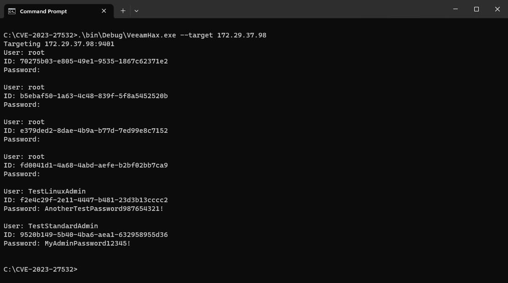

# CVE-2023-27532

Proof of Concept code to exploit CVE-2023-27532 and either leak plaintext credentials or perform remote command execution.

## Overview

For a detailed analysis of the vulnerability and exploitation please read the Rapid7 [AttackerKB Analysis](https://attackerkb.com/topics/ALUsuJioE5/cve-2023-27532/rapid7-analysis).

## Building

Open in Visual Studio. You will need to either add or update the references to `Veeam.Backup.Common.dll`, `Veeam.Backup.Interaction.MountService.dll`, and `Veeam.Backup.Model.dll`. To make things easier, install Veeam Backup & Replication on the development machine, although this is not a hard requirement.

## Usage

Leak the plaintext credentials from the remote server.

```
> VeeamHax.exe --target 192.168.0.100
```



Run an arbitrary command with local system privileges on the remote server.

```
> VeeamHax.exe --target 192.168.0.100 --cmd calc.exe
```


## Credits

Previous research into this vulnerability was performed by:

 * [CODE WHITE GmbH](https://twitter.com/codewhitesec/status/1633948476353519616)
 * [Huntress](https://www.huntress.com/blog/veeam-backup-replication-cve-2023-27532-response)
 * [Y4er](https://y4er.com/posts/cve-2023-27532-veeam-backup-replication-leaked-credentials/)
